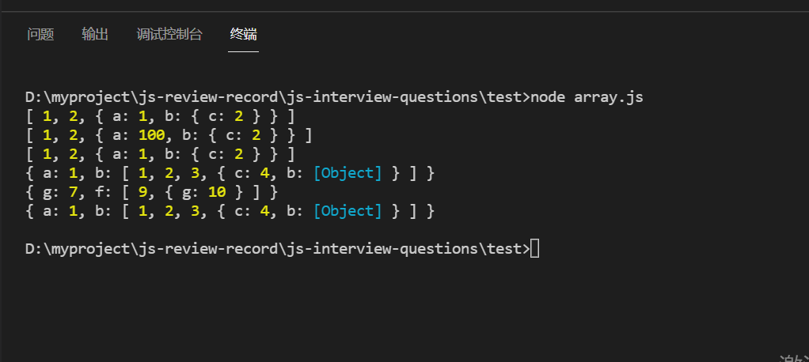
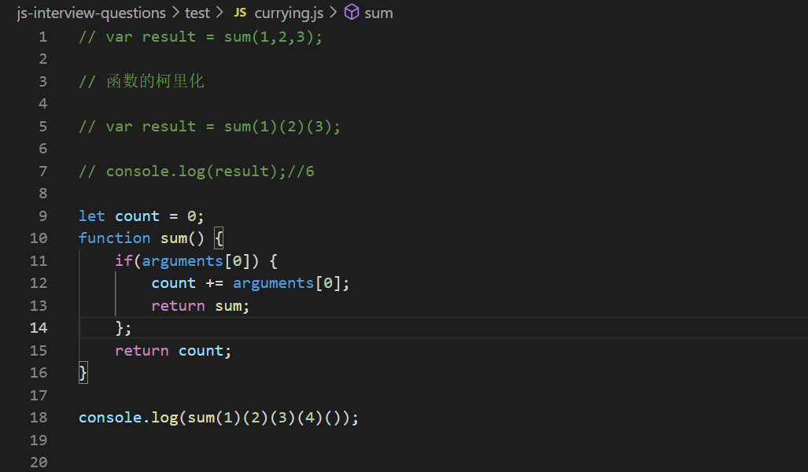

<!-- 本篇文章主要记载非系统归类的面试题 -->
# NaN 
***
  1. 是一个非数字， 是一个全局对象的属性
  2. typeof NaN  => number
  3. 判断是否为NaN 方法
     1. isNaN()， 方法并不靠谱， 主要在处理非数字类型的时候会有差错，比如 inNaN ('hhhh'), => false， 
     2. es6 的 Number.isNaN() 更为准确，
     3. 前两者的区别在与， 前者是如果当前值是NaN , 或者将其强制转化成数字后将是NaN, 放回true; 后者是仅当值当前是NaN时， 才返回NaN,
  4. NaN 不等于任何值， 包括自己
  5. 产生原因， 对负数取平方， Math.sqrt(-1); 或者将一个字符串解析成数字失败的时候， 如parseInt('nnnnn');
***
# 浏览器缓存
## 浏览器强制刷新/禁用资源缓存是怎么做到的
***
  1. 在请求头部配置cache-control: no-cache 或者是 Pragma(老字段， 保留是为了向下兼容): no-cache
  2. cache-control 是http1.1 提出的特性， 弥补expires的缺陷加入的， 提供了精确细致的缓存功能.
***
## 浏览器的强缓存
***
  1. 在响应头配置 cache-control 和 Expires(HTTP1.0) , 设置浏览器的强缓存
***  
## 浏览器的协商缓存
***
  1. Reauest Header配置If-Modified-Since 和 If-None-Match， 这是一对值， HTTP1.0的产物
  2. Response Header配置Etag 和 Last-Modified 这是一对对应的值, HTTP1.1产物
  3. Last-Modified 只能精确到秒级， 如果一个文件在一秒内同时会更改多次， 它将不能准确的标注文件的新鲜度，Etag比Last-Modified, 优先级高
***
## 缓存位置
***
  浏览器会在内存， 硬盘中开辟一个空间用来保存请求资源的副本
***
# 浏览器渲染过程及回流和重绘
***
  ## 首先是浏览器的渲染过程
  1. 浏览器采用的是流式布局模型（flow based layout）
  2. 第一步解析html ,生成DOM, 解析css, 生成CSSOM树。
  3. 将DOM 和 CSSOM 树结合， 生成渲染树（Render Tree）.  首先从DOM 的根节点遍历每个可见的节点,对于每个可见的节点， 找到CSSOM树种对应的规则， 并应用它们。 然后生成DOM 树
  4. 根据生成的render tree, 得到节点的几何信息（位置， 大小）,进行回流和重绘。
  5. 由于浏览器采用的是流式布局模型， 所以对render tree 的计算通常指遍历一次就可以完成， 但对于table及其内部元素之外， 它们可能需要多次计算，通常需要比同等元素多花三倍的时间， 所以尽量避免使用table
  ## 回流和重绘
  1. 回流就是布局或者几何空间属性（比如：height,width等 ）发生改变引起的部分页面或者整个页面的布局更新。
  2. 重绘就是元素的样式的使用或者其他不改变布局的属性的改变引起的页面变化。
  ## 浏览器优化
  现在浏览器多是通过队列机制批量改变更新布局， 浏览器会把修改操作放在队列中，当队列达到一个阈值就会清空队里。但是有一些操作会直接强制渲染清空队列， 如下：
  1. offsetTop, offsetLeft, offsetWidth,offsetHeight
  2. scrollTop, scrollLeft, scrollWifth,scrollHeight
  3. clientTop, clientLeft, clientWidth, clientHeight
  4. width, height
  5. getComputedStyle()
  6. getBoundingClientRect()
  ## 减少回流重绘的方法
  ### css
  1. 使用visibility替换display:none, 前者只会重绘， 后者则会回流
  2. 避免使用table布局，
  3. 尽可能在DOM 树的末端改变class , 回流是不可避免的， 但可以减少其影响， 尽可能影响更少的节点。
  4. 避免设置多层内联样式， css选择符从右往左匹配查找，避免节点层级过多
  5. 如果要对样式多次更改可以：
  ```
  const el = document.getElementById("text");
  el.style.cssText += 'boder-left: 2px; padding: 4px';

  ```
  6. 批量修改DOM: 使元素脱离文档流，进行多次修改， 在挂载在页面上. 
***
# vue 不能检测到数组和对象的变化，
***
  ## 对于对象
  1. 无法检测对象属性的添加和移除， 由于vue 只会在初始实例化时对属性添加getter/setter的转化，实例化之后对象的添加或者删除属性， 不能引起响应式
   2. 解决方法是Vue.set(object, propertyName, value) 或者是this.$set(object, propertyName, value);
   3. 有时候肯能会同时写入多个属性， this.someObject = Object.assign({}, this.someObject, {a: 1, b: 2});
   ## 对于数组
   1. 不能检测到利用索引直接设置一个数组时，如arr[1] = 'a'
   2. 修改数组的长度时， 如： arr.length = 7;
   3. 解决方法Vue.set(arr, indexOfItem, newValue)或者是 this.$set(arr, indexOfItem, value);
   4. 解决修改数组长度时， arr.splice(newLength);
***
# js中六种假值
***
   1. 假值定义， 有一个变量foo, if(!foo) 都是true, 则foo都是假值。
   2. 假值有 '', NaN, undefined, null, false, 0,
***
# 实现深拷贝的方法
***
1. 数组的组合方法
```
var arr = [];
var arr1 = [].concat(arr); // 仅对不包含引用类型的以为数据的深拷贝
```
2. slice 截取
```
var arr = [];
var arr1 = arr.slice(); // 仅对不包含引用类型的以为数据的深拷贝
```
3. for 循环
```
var arr = [];
var arr1 = [];
for(var i = 0; i < arr.length; i++) {
  arr1.push(arr[i]);
}
```
4. 类型转换
```
var arr = [];
var arr1 = JSON.parse(JSON.stringfy(arr)) // 如果内部有函数， 则会忽略
```
5. es6 扩展运算符
```
var arr = [];
var arr1 = [...arr]
```
6. loadsh 库的_.cloneDeep()
7. 实现深拷贝
```
function deepCopy(obj) {
  let newObj = Array.isArray(obj)? [] : {}; // 判断是一个数组还是一个对象
  // 遍历传进来的参数对象
  if (Array.isArray(obj)) {
    obj.forEach((item, index) => {
      if(typeof item === 'object') {
        newObj =  newObj.concat(deepCopy(item));
      } else {
        newObj.push(item);
      }
    })
  } else {
    for (key in obj) {
      if (typeof obj[key] === 'object') {
        newObj[key] = deepCopy(obj[key]);
      } else {
        newObj[key] = obj[key];
      }
    }
  }
  return newObj;
}

const obj = [1,2,{a:1, b:{c:2}}];
const obj2 = deepCopy(obj);
obj2[2].a = 100;
console.log(obj);
console.log(obj2);
console.log(JSON.parse(JSON.stringify(obj)));

const obj3 = {
  a:1,
  b:[1,2,3,{c:4, b:{g:7, f:[9,{g:10}]}}]
}
const obj4 = deepCopy(obj3);
console.log(obj4);
console.log(JSON.parse(JSON.stringify(obj3)));
```

***
# 函数柯里化
***
 就是把接受多个参数的函数转化成一系列接受一个参数的技术
 ```
  function add(a,b,c) {
    return a+b+c;
  }
  add(1,2,3);
  <!-- 转换成下面的调用形式 -->
  add(1)(2)(3);
 ```
 
***
